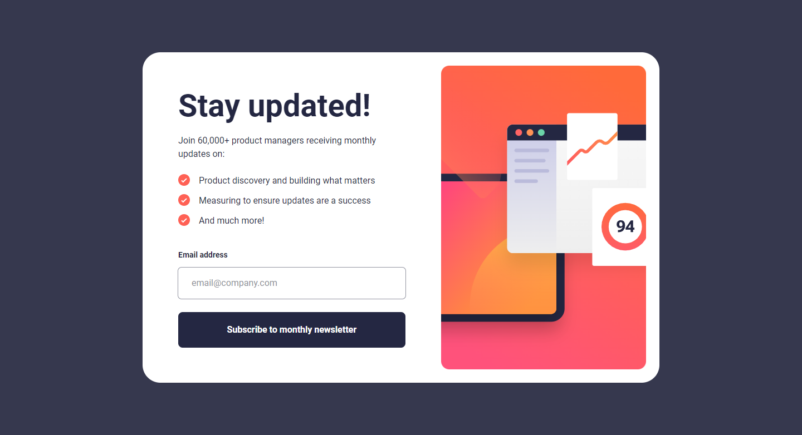

# Frontend Mentor - Newsletter sign-up form with success message solution

## Welcome! 👋

Thanks for checking out this front-end coding challenge solution.

## Table of contents

- [Overview](#overview)
  - [Preview Screenshot](#preview-screenshot)
  - [Links](#links)
- [My process](#my-process)
  - [Built with](#built-with)
- [Author](#author)

## Overview

This is a solution to the [Newsletter sign-up form with success message challenge on Frontend Mentor](https://www.frontendmentor.io/challenges/newsletter-signup-form-with-success-message-3FC1AZbNrv). Frontend Mentor challenges help you improve your coding skills by building realistic projects.

### Preview Screenshot

### Links

- Solution URL: [github.com/lucasweidas/newsletter-sign-up](https://github.com/lucasweidas/newsletter-sign-up)
- Live Site URL: [newsletter-sign-up.vercel](https://newsletter-sign-up-vert.vercel.app/)

## My process

### Built with

- NextJS 13
- TypeScript
- Tailwind CSS
- React Hook Form
- Yup

## Author

- Github - [@lucasweidas](https://github.com/lucasweidas)
- Frontend Mentor - [@lucasweidas](https://www.frontendmentor.io/profile/lucasweidas)
